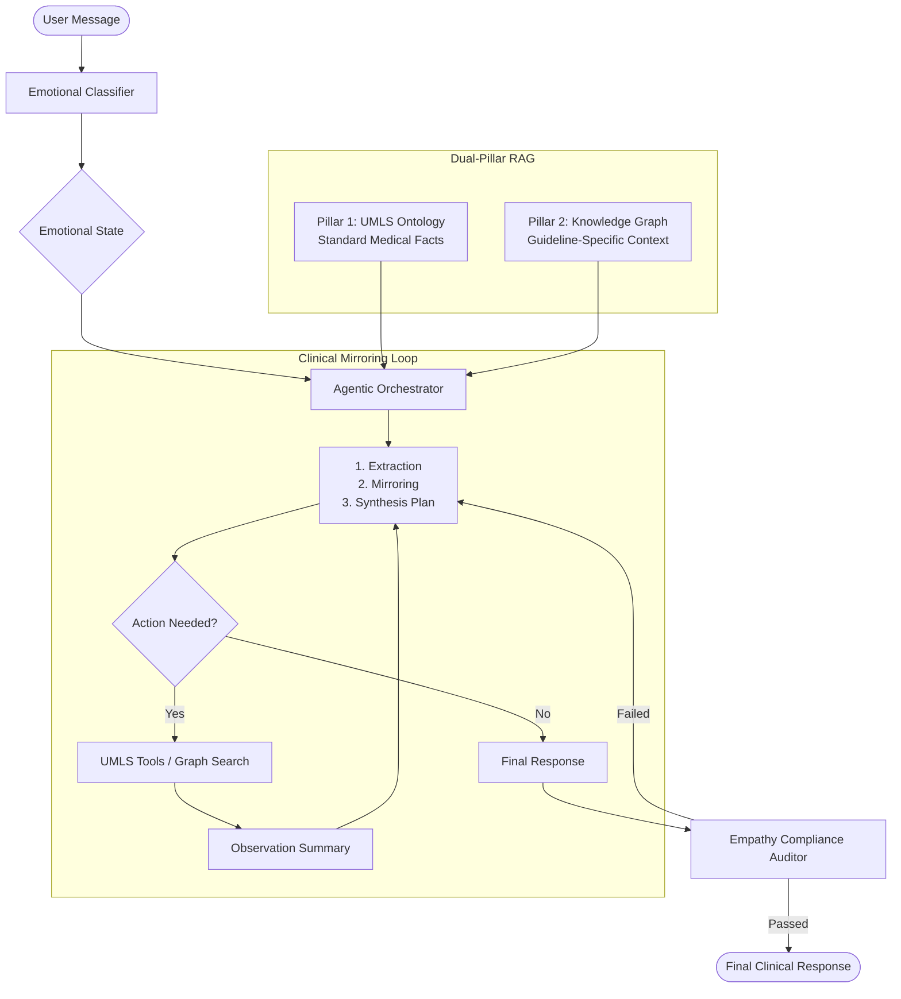

# Dual-Pillar Empathy Pipeline (Clinical AI)

This repository implements a state-of-the-art **Dual-Pillar RAG** conversational pipeline designed for clinical environments. It focuses on balancing medical factual accuracy (grounding) with structured empathy (framing) using the **Clinical Mirroring** method.

---

## 🏗 System Architecture

The pipeline operates as a modular agentic loop that integrates two distinct "pillars" of knowledge to inform every response.



---

## 🧬 Core Methodologies

### 1. Clinical Mirroring Method
Unlike standard chatbots, this agent uses a **Thinking-First** approach. For every patient query, it must complete an internal 3-step reasoning loop (the "Denkprozess") before answering:

-   **Extraction**: Identifying the clinical facts required (e.g., PSMA side effects, PSA thresholds).
-   **Mirroring**: Mapping the patient's detected emotional state to a specific **NURSE protocol** strategy:
    -   **N**aming the emotion.
    -   **U**nderstanding (Validating the feeling).
    -   **R**especting (Acknowledging strength).
    -   **S**upporting (Offering partnership).
    -   **E**xploring (Checking for deeper worries).
-   **Synthesis Plan**: Planning how to naturally weave the clinical facts into the empathic frame.

### 2. Dual-Pillar RAG
-   **Pillar 1 (Ontological Verification)**: Direct interaction with medical ontologies (UMLS) to verify relationships between treatments and conditions.
-   **Pillar 2 (Vector/Graph Context)**: Retrieval of specific clinical guidance from a vector-indexed knowledge graph built from 70+ technical PDFs (e.g., EANM guidelines).

---

## 🚀 Operational Guide

### Prerequisites
- **Ollama**: Local LLM endpoint (e.g., `Gemma-2-9b` or `MedGemma-1.5-4b`).
- **Python 3.10+**.

### Setup
```bash
# Install dependencies
pip install -r requirements_study.txt

# Configure environment
export OLLAMA_URL="http://localhost:11434/api/chat"
export OLLAMA_MODEL="gemma2:9b"
```

### Running the Pipeline
You can run the pipeline in two modes depending on your hardware and latency requirements:

**A. Fast Path (Iterative Testing)**:
Skips the full GraphRAG extraction and uses fallback knowledge. Best for UI/Empathy testing.
```bash
python runners/run_empathy_pipeline.py --questions data/psma_sample_questions.json --no-graph --out results/psma_fast_test.json
```

**B. Full End-to-End (Production Validation)**:
Uses the full vector store and knowledge graph to verify every clinical claim.
```bash
python runners/run_empathy_pipeline.py --questions data/psma_sample_questions.json --out results/psma_final_results.json
```

---

## 📊 Performance Analysis

Once a pipeline run is complete, use the export utility to generate Excel-compatible CSVs for expert evaluation. This tool automatically separates internal **thinking** from the **final response**.

```bash
python tools/export_to_csv.py results/psma_fast_test.json
```

---

## 📁 Repository Structure

-   `core/`
    -   `agent_engine.py`: The main orchestrator managing the ReAct loop.
    -   `empathy_framing.py`: NURSE protocol logic and emotional classifiers.
    -   `vector_rag.py`: Knowledge graph and vector retrieval logic.
-   `runners/`
    -   `run_empathy_pipeline.py`: Batch experimental runner.
    -   `test_clinical_mirroring.py`: Validation script for empathic adherence.
-   `tools/`
    -   `export_to_csv.py`: Data conversion utility for results analysis.
    -   `ingest_pdfs_vectorstore.py`: Pipeline for indexing clinical documentation.

---

## 📝 Compliance & Ethics
This system is an **assistive tool** and does not provide medical diagnoses. It enforces strict behavioral constraints:
- No dosing or numerical dosimetry.
- No prognosis or survival probability claims.
- Mandatory empathy validation before technical explanations.
